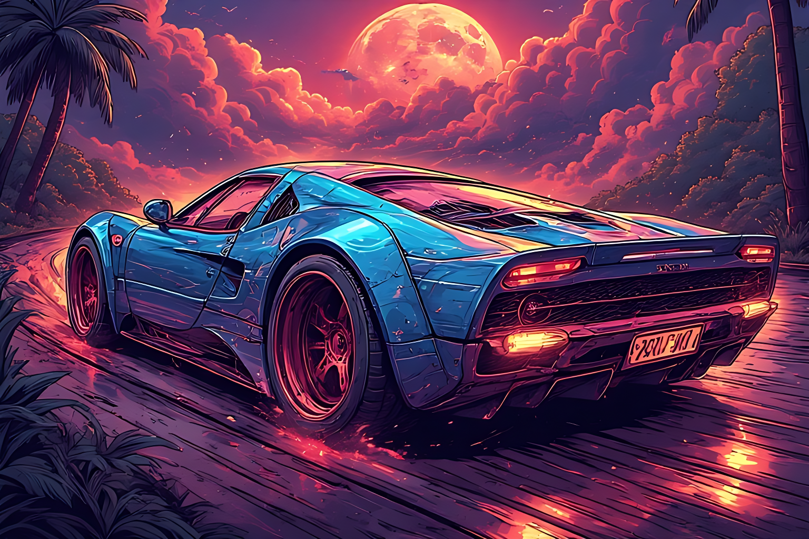

# Drunk-Driving-Simulator
 A Game Means To be Funny And Realistic And Accessible To Everyone In The Form Of Source Code Or Free Binary Distributions

The Game Is Fully Open Source And Is Licensed Under The MIT License!

Contributions Are Accepted!
All You Need To Do Is To Fork This Repository And Commit The Changes And Simply Make A Pull Request.
 - Even if you are not familiar you can still contribute to the game by suggesting ideas as pull requests! because everyone matters in Open Source.

 > A Special Thanks To The Entire Open Source Community For Providing Tools To Make This Project Possible, And A Special Thanks To People Like You, Because Of You This Game Was Possible.

 > The Game here is for developers only so do not build it yourself to play! Use the official binary prebuilts when ever they will be released as currently the game is only for developers who are familiar with Godot Engine.